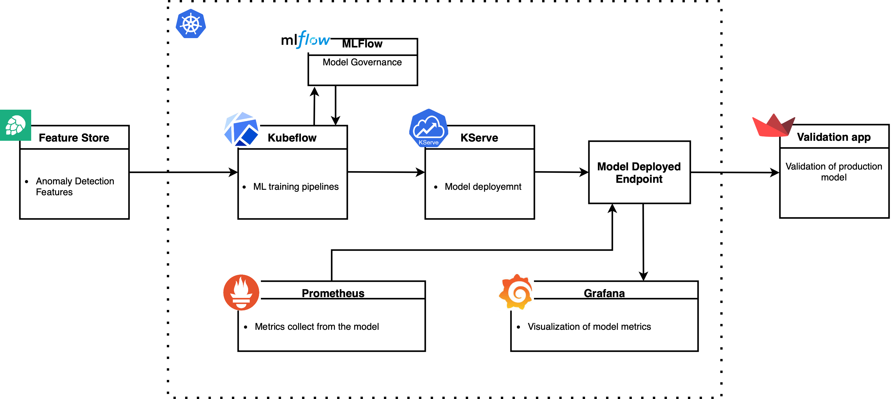
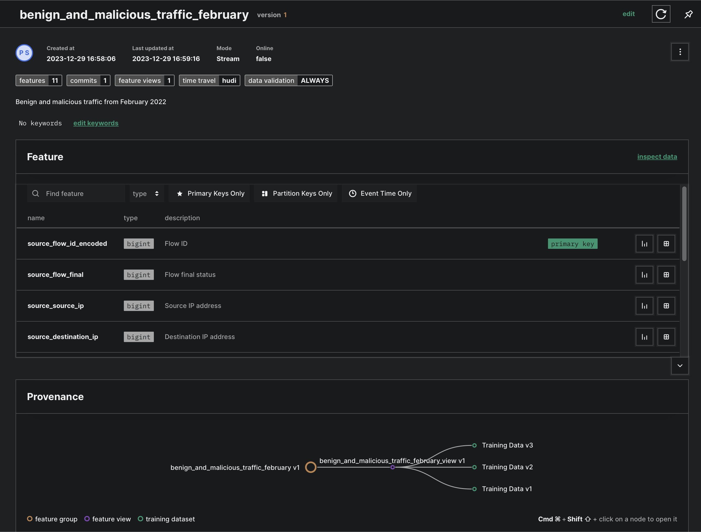

# MLOps - Kubernetes Attack Detection

## Introduction

- This goal of this project is to develop a MLOps system able to analyze Kubernetes traffic data and detect attacks on a Kubernetes system. The project is based on a dataset is created by NetFlow data that is collected from a Kubernetes cluster [Kubernetes Attack Dataset](./data/README.md).

- In a MLOps system the use of a Feature Store is essential. The Feature Store is a central repository of features that can be used for training and inference. The Feature Store is used to store the features extracted from the NetFlow data. The Feature Store implemented was [Hopsworks](https://www.hopsworks.ai)

- To develop the MLOps system, the Kubeflow framwork was used to create a pipeline that trains a model to detect attacks on a Kubernetes system. The pipeline is deployed on a Kubernetes cluster and is defined through the kubeflow pipeline SDK in Python.

NOTE: the original repo is in deti-uaveiro organizaiton ([here](https://github.com/detiuaveiro/aas-project-kubernetes-attacks-detection-98491)), but I am not able to make it public, so I copied the repo to my personal account.

## Architecture

The architecture of the MLOps system is shown in the figure below. The MLOps system is composed of a Kubernetes cluster, a Feature Store, a Kubeflow Pipeline and a Validation Service. The Feature Store is used to store the features extracted from the NetFlow data. The Kubeflow pipeline is used to train the model to detect attacks on a Kubernetes system. And the Validation Service is used to validate the model in production.




## How to run

Before starting, it is need to install the project dependencies. To do that, run the following commands:

- Generate a virtual environment
```bash
python3 -m venv .venv
```
- Install the dependencies
```bash
pip install -r requirements
```

- Activate the virtual environment
```bash
source .venv/bin/activate
```

## Data

The data used in this project is the Kubernetes Attack Dataset. The data is generated by NetFlow data that is collected from a Kubernetes cluster. The data is stored in a .csv file. More details about the data can be found [here](./data/README.md).

## K3s

The Kubernetes cluster used in this project is [K3s](https://k3s.io/). K3s is a lightweight Kubernetes distribution that is easy to install and use. To install K3s, run the following commands:

- Install K3s master
```bash
curl -sfL https://get.k3s.io | sh -
```

- Install K3s worker
```bash
curl -sfL https://get.k3s.io | K3S_URL=https://myserver:6443 K3S_TOKEN=mynodetoken sh -
```
Where the K3S_URL is the master ip and K3S_TOKEN are the values obtained from the master node, that is stored at /var/lib/rancher/k3s/server/node-token.


## Feature Store

All the code for the usage of feature store can be found [here](./feature-store/). These Python scripts are useful to generate a feature pipeline inside the feature store. The file [main.py](./feature-store/main.py) is used to load the data from a .csv file, preprocess the data ([pre_process_data.py](./feature-store/pre_process_data.py)), generate validation [feature_validation.py](./feature-store/feature_validation.py) on the data (for example, the column "X" have to has values between 0 and 10, if not thown an error), upload the data to a feature group, and generate a training dataset, that in reality are splited into 3 subsets: train, validalidation, and test. The validation subset will be used to inference the model later in produciton.



 - Enter in the feature-store folder:
```bash
cd feature-store
```
 - Run the main.py script:
DISCLAIMER: To access the Feature Store it is need a API_KEY (the visual studio code asks for it once and then you do not need to put it again).
```bash
python3 main.py
```
## ML

The ML experimentations are made in the [ml](./ml/) folder. There are two approaches to detect attacks on a Kubernetes system: one [baseline](./ml/main.ipynb) and other with an [AutoEncoder](./ml/main_AE.ipynb). Each notebook is documented so it is easy to understand what is happening in each step.

## Kubeflow

The Kubeflow pipeline is defined in the [kubeflow](./kubeflow/) folder. The pipeline is defined in the [pipeline.py](./kubeflow/pipeline.py) file. The pipeline is composed of 6 steps:
 - Load Data
 - Create a MLFlow Experiment
 - Train the models
 - Select the best model
 - Upload model to Storage
 - Deploy the model


To generate the pipeline, run the following command, inside the kubeflow folder:
```bash
python3 kf-pipeline.py
```

## Validation

In order to know if the model is performing well, it is need to validate the model. So in order to do that a small validation test is used. The validation data split is taken and requests are made to the model ([example](./k3s/kserve/test-endpoint.sh) as I am not using DNS the model predictor endpoint will change every time I do a port-forward). So, a streamlit server was develop in order to every second it made a request to the model and compares de results, if is correct it increases the correct bar if not it increases the incorrect bar.

To run the validation application, run the following command (make sure you are inside the virtual environment):
```bash
streamlit run validation.py
```


## Report

The report of the project can be found [here](./report/AAS_Report.pdf).


